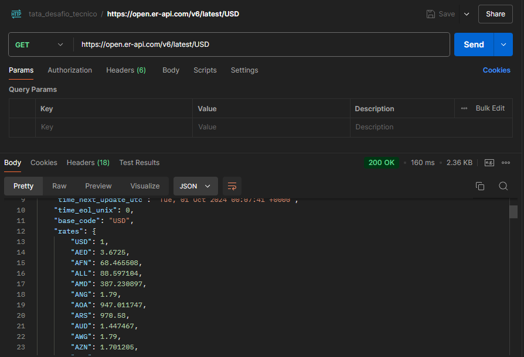
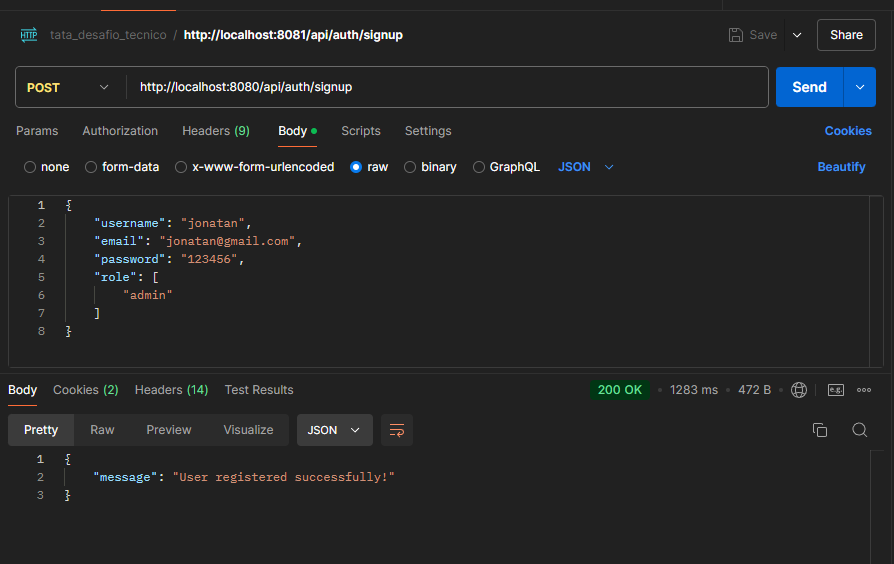
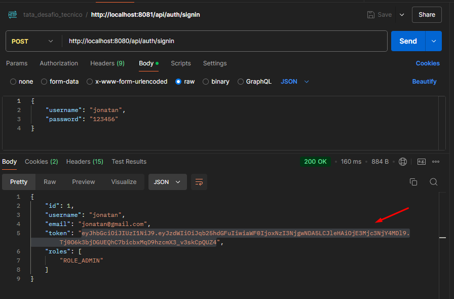
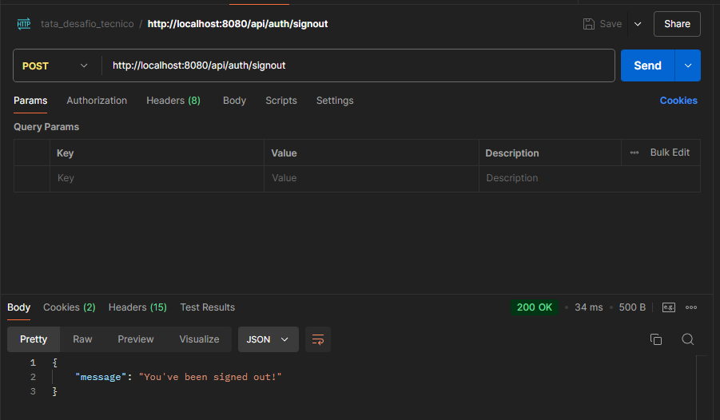
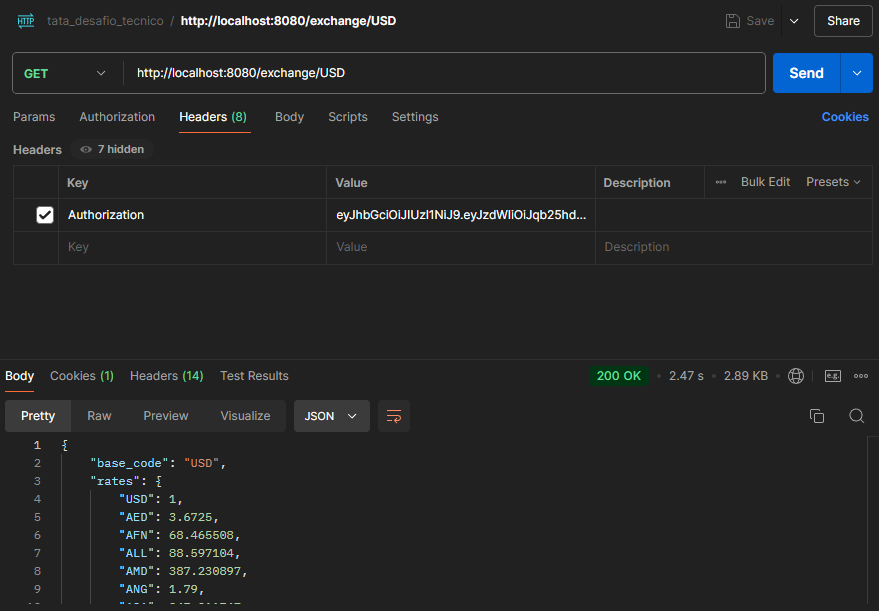
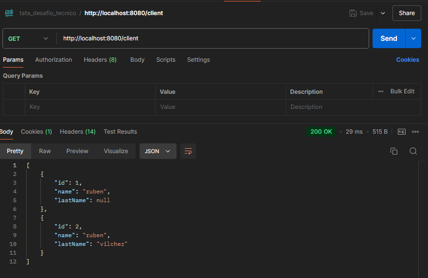
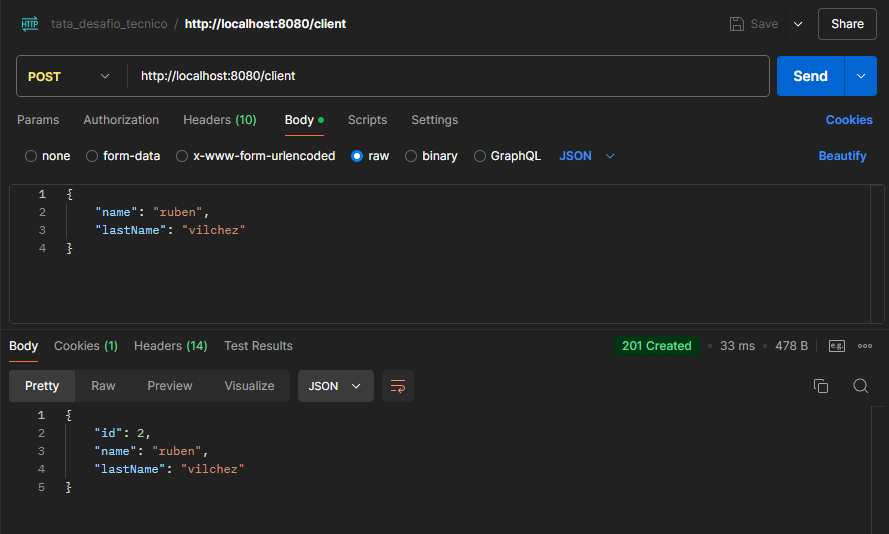

# Ruben Jonatan Maza Vilchez
Tata - Desafio Tecnico

# client-api-hexagonal
Proyecto de Arquitectura Hexagonal (puertos y adaptadores) separando capas por modulos Java y utilizando Spring Boot como framework

## Api Exchange

## Registrar un nuevo usuario

## Iniciar sesion - JWT

## Cerrar sesion

## Obtener exchange desde api principal
https://open.er-api.com/v6/latest/USD

## Listar clientes

## Registrar cliente
